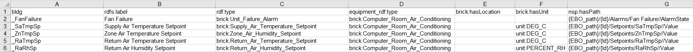
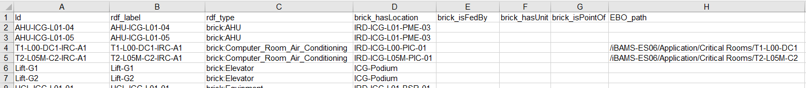
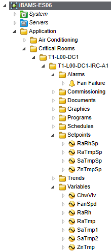
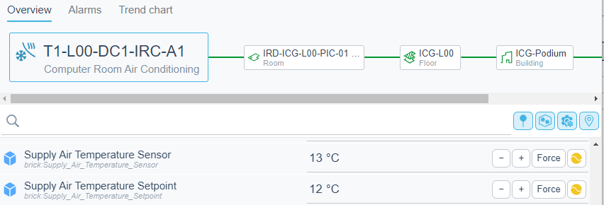

# ebo-brick-tools
Python tools for creating Brick models for EcoStruxure Building Operation Semantic. [Here is a link to the online repository](https://github.com/clivegross/ebo-brick-tools).

### References
- [Brick schema](https://brickschema.org/)
- [brickify](https://brickschema.readthedocs.io/en/latest/brickify/index.html)
- [EcoStruxure Building Operation Semantic](https://ecostruxure-building-help.se.com/)
- [RDF 1.2 Schema](https://www.w3.org/TR/rdf12-schema/)

## Make brickify config for equipment models from csv

Make a brickify config file for bulding a Brick equipment model with EBO Semantic relationships.

Requires a csv containing the equipment model points for a Brick equipment class.

Example equipment model points csv:


The csv contains the following fields, note empty fields are skipped:

| Field name | Description |
|------------|-------------|
| bldg | point ID suffix, which will be prefixed in the config file by the equipment ID, eg `bldg:{Id}_SaTmpSp`|
| rdfs:label | The [human readable version of the point name](https://www.w3.org/TR/rdf12-schema/#ch_label), eg "Supply Air Temperature Setpoint" |
| rdf:type | The Brick class of the point, ie [brick:Point](https://brickschema.org/ontology/1.3/classes/Point), eg brick:Supply_Air_Temperature_Setpoint |
| equipment_rdf:type | The Brick class of the equipment that the point is related to, ie [brick:isPointOf](https://brickschema.org/ontology/1.3/relationships/isPointOf), eg `brick:Computer_Room_Air_Conditioning` (rdf schema property) |
| brick:hasLocation | The ID of the location of the point, ie [brick:hasLocation](https://brickschema.org/ontology/1.3/relationships/hasLocation), eg "DC1" |
| brick:hasUnit | The units associated with the measured point, ie[brick:hasUnit](https://brickschema.org/ontology/1.3/relationships/hasUnit), eg `unit:DEG_C` |
| nsp:hasPath | The path of the EBO object to associate with the point. Placeholders can be used that will be written into the config file, eg `{EBO_path}/{Id}/Setpoints/SaTmpSp//Value`, where brickify will expect `EBO_path` and `Id` columns to be defined in the data input file. So in this example, if a row in the brickify data input file has the following fields, Id: "T1-L00-DC1-IRC-A1", EBO_path:"/iBAMS-ES06/Application/Critical Rooms/T1-L00-DC1", the Brick model created by brickify will include the following relationship for this point: `nsp:hasPath "/iBAMS-ES06/Application/Critical Rooms/T1-L00-DC1/T1-L00-DC1-IRC-A1/Setpoints/SaTmpSp//Value"`. (See [SE nsp schema](https://github.com/se-ontologies/se-ontologies.github.io)). |

The example fields in the table above produces the following brickify config yaml:
```
  -
    conditions:
      - |
        '{rdf_type}' == "brick:Computer_Room_Air_Conditioning"
    data: |-
      bldg:{Id}_SaTmpSp rdfs:label "Supply Air Temperature Setpoint" ;
        rdf:type "brick:Supply_Air_Temperature_Setpoint" ;
        brick:hasUnit "unit:DEG_C" ;
        nsp:hasPath "{EBO_path}/{Id}/Setpoints/SaTmpSp//Value" ;
        brick:isPointOf bldg:{Id} .
```

Example usage:

```
# modify the filename variables in this script directly
python .\make_config_yml_from_csv.py
```
Or:

```
# import the function into your own script
from make_config_yml_from_csv import make_config

# set the path to the equipment model points csv here:
equipment_model_points_csv_file = "example/in_row_cooler_model_points.csv"
# set the output config yaml file name here:
config_yaml_file = "example/equipment_model_in_row_cooler.yml"
# Set the desired equipment class rdf:type
equipment_rdf_type = "brick:Computer_Room_Air_Conditioning"

make_config(equipment_model_points_csv_file, config_file, equipment_rdf_type)
```

## Create Brick models from csv

Use brickify to create a Brick model ttl file from input csv data and a brickify config file.



Example usage:

```
# modify the filename variables in this script directly
python .\brickify_from_csv.py
```

Or:
```
# import the function into your own script
from brickify_from_csv import brickify_command

# set the path to the input equipment data csv here:
equipment_data_csv_file = "example/in_row_cooler_data.csv"
# set the config yaml file name here:
config_file = "example/equipment_model_in_row_cooler.yml"
# set the output ttl file  here:
output_file = "example/in_row_cooler_model.ttl"

brickify_command(equipment_data_csv_file, output_file, config_file)
```

## Putting it all together

Now combine the two functions to produce a Brick model ttl file to import into GraphDB to enable EBO Semantics.

In this example, we are monitoring 20 In Row Coolers in EBO. Each instance has the following EBO application structure:



To build the Semantic model we need to:
1. Define the equipment points model in a CSV, *"example/in_row_cooler_model_points.csv"*. We assume every occurence of the In Row Cooler will have a similar path to each EBO point, described in the `nsp:hasPath` field, eg `{EBO_path}/{Id}/Setpoints/SaTmpSp//Value` 
1. Define the data for the 20 In Row Coolers in another CSV, *"example/in_row_cooler_data.csv"*. We set the path prefix unique to each occurence of In Row Cooler in the `EBO_path` field, eg `/iBAMS-ES06/Application/Critical Rooms/T1-L00-DC1`
1. Define the equipment class, `brick:Computer_Room_Air_Conditioning`.
1. Execute the python script (see example below) to build the brick model.
1. Check the output ttl file for errors, import the ttl file into GraphDB and Enrich Model in EBO.
1. Check Semantic model and point tagging in EBO.

Example:
```
from build_brick_equipment_model import build_model

# set the path to the equipment model points csv here:
equipment_model_points_csv_file = "example/in_row_cooler_model_points.csv"
# set with the desired equipment class rdf:type
equipment_rdf_type = "brick:Computer_Room_Air_Conditioning"
# set the path to the equipment data csv here:
equipment_data_csv_file = "example/in_row_cooler_data.csv"
# set the output ttl filename here:
output_file = "example/in_row_cooler_model.ttl"

build_model(equipment_model_points_csv_file, equipment_data_csv_file, equipment_rdf_type, output_file)
```

Once the model is imported, confirm it is correct in EBO: 



## TODO

1. Scaffold this out to build entire Semantic model for multiple equipment classes from multiple input files from a single script.
1. Automate import model into GraphDB using the [ImportRDF Tool](https://graphdb.ontotext.com/documentation/10.0/loading-data-using-importrdf.html).
1. Update scripts to easily rebuild model and reimport when source data changes. 
1. Abstract the functions into classes and build ORM classes to represent the Brick classes (Equipment, Point, Location) for extensibility.
